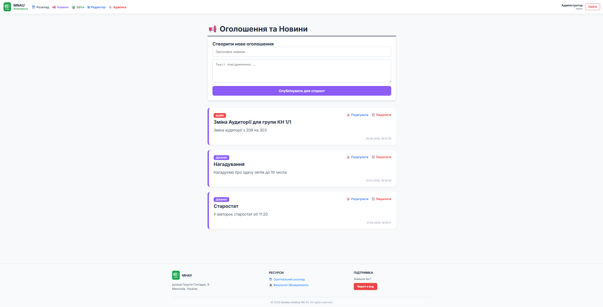
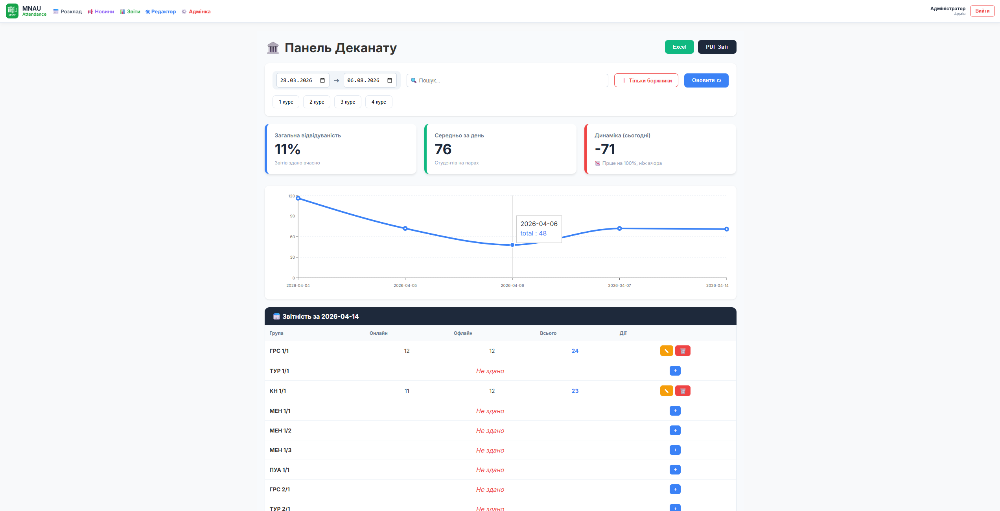
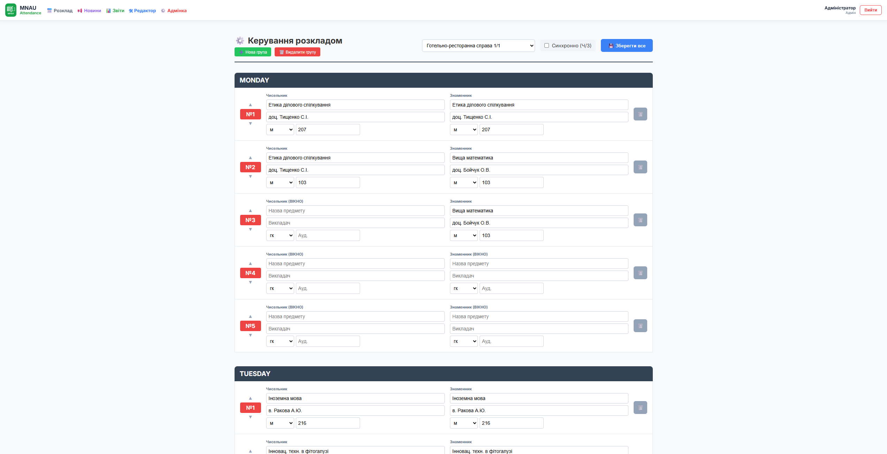

# 🎓 MNAU Attendance Control — University Management & Attendance Platform


Comprehensive web application designed for university schedule management, daily attendance tracking, and administrative analytics. Built with a modern frontend stack, role-based access control, and seamless database integration with offline fallback capabilities.

**[Live Demo](https://andreinik1.github.io/university-schedule/)**

---

## Quick Demo Access

To explore all administrative features, analytical tools, and schedule editors, use the universal admin account below:

| Role | Username | Password | Accessible Features |
| :--- | :--- | :--- | :--- |
| **Full Admin Access** | `admin` | `admin` | Analytics Dashboard, Schedule Editor, Account Management, Announcements |

> **Note:** The application includes a built-in offline mode with mock datasets, ensuring all charts, tables, and interfaces operate smoothly even without direct database access.

---

## Key Features

* **📅 Schedule Editor & Viewer:** Interactive timetable customization supporting weekly parity (numerator / denominator), custom time slots, and room allocations.
* **📊 Dean's Office Analytics & Reporting:** Real-time dashboards monitoring attendance percentages, student dynamics, and automatic generation of **PDF & Excel** reports.
* **🛡️ Role-Based Access Control (RBAC):** Distinct interfaces and capabilities tailored for Admins, Dean staff, and Group Monitors.
* **⚡ Offline & Mock Data Fallback:** Robust architecture ensuring full UI functionality via local datasets even if database connectivity is unavailable.
* **📱 Fully Responsive Design:** Clean, accessible user interface optimized across desktop and tablet screen sizes.

---

## Photos of interface





---

## Tech Stack & Tools

* **Frontend:** React 18, TypeScript, Vite
* **Routing & State:** React Router (Hash Router for SPA deployment)
* **Styling:** Tailwind CSS / SCSS
* **Backend & Database:** Supabase (PostgreSQL, REST API, Auth)
* **Export Utilities:** `xlsx` for Excel generation, PDF rendering libraries

---

## Local Development Setup

1. **Clone the repository:**
   ```bash
   git clone [https://andreinik1.github.io/university-schedule/](https://andreinik1.github.io/university-schedule/)
   cd university-schedule
   ```

2. **Install dependencies**
    ```bash
    npm install
    ```

3. **Configure Environment Variables**
    Create a .env.local file in the root directory:
    ```bash
    VITE_SUPABASE_URL=your_supabase_project_url
    VITE_SUPABASE_ANON_KEY=your_supabase_anon_key
    ```

4. **Start local development serve**
    ```bash
    npm run dev
    ```

## License
This project is licensed under the MIT License.